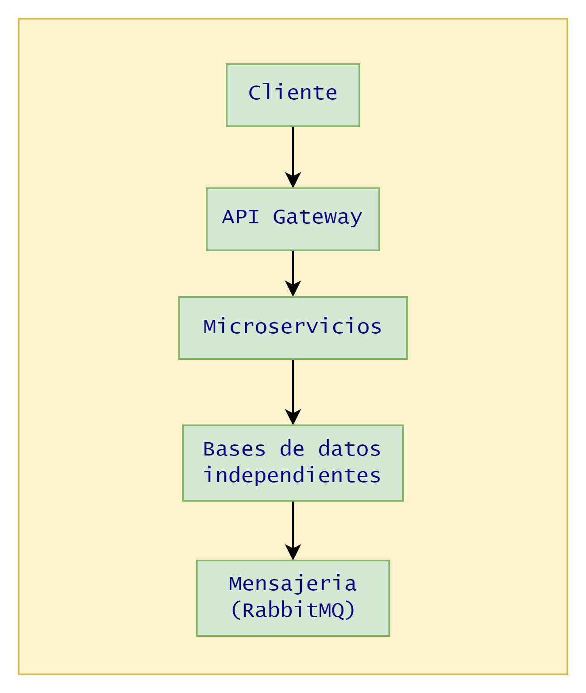

# NovaBank - System Architecture
## 1. Introducción
NovaBank es un sistema bancario distribuido desarrollado con java 21, Spring Boot y
Spring Cloud utilizando una arquitectura de microservicios.

El objetivo del proyecto es simular el funcionamiento de un banco moderno siguiendo
buenas prácticas de desarrollo empresarial, aplicando principios como Clean Architecture,
separación de responsabilidades y comunicación entre servicios.

---

## Objetivos
1. Implementar Spring Security de microservicios.
2. Centralizar la configuración mediante Spring Cloud Config.
3. Descubrir servicios utilizando Eureka Server.
4. Comunicar servicios mediante REST y mensajería.
5. Desplegar la aplicación utilizando Docker.
6. Implementar pruebas unitarias e integración.
7. Aplicar buenas prácticas de diseño y documentación.

---

## Arquitectura general

    

---

## Infraestructura

Actualmente, el proyecto cuenta con la siguiente estructura

* Config Server
* Eureka Discovery Server
* API Gateway

---

# Microservicios Planeados
## Auth Service

Responsabilidades
* Registro de Usuarios.
* Inicio de sesión
* Generación de JWT.
* Refresh Tokens
* Gestión de Roles.
* Gestion de Permisos

Base de datos: 
auth_db

---

## Customer Service

Responsabilidades
* Gestión de clientes
* Información personal
* Direcciones
* Contactos
* Validaciones

Base de datos 
customer_db

---

## Account Service

Responsabilidades:
* Apertura de cuentas.
* Consulta de saldo.
* Estado de cuenta.
* Tipos de cuenta.

Base de datos: 
account_db

---

## Transaction Service

Responsabilidades:
* Depósitos.
* Retiros.
* Transferencias.
* Historial de movimientos.

Base de datos: 
transaction_db

---

## Notification Service

Responsabilidades:
* Correos electrónicos.
* Notificaciones.
* SMS (simulado).

Base de datos: 
notification_db

---

## Audit Service

Responsabilidades:
* Registro de eventos.
* Auditoría.
* Trazabilidad.
* Logs de negocio.

Base de datos 
audit_db

---

## Tecnologías
* Java 21
* Spring Boot
* Spring Cloud
* Spring Security
* Spring Data JPA
* Maven
* PostgreSQL
* Docker
* Docker Compose
* RabbitMQ
* Redis
* Git
* GitHub Actions
* OpenAPI / Swagger

---

## Principios de Arquitectura
* Arquitectura basada en microservicios.
* Base de datos por servicio.
* Configuración centralizada.
* Descubrimiento de servicios.
* Comunicación desacoplada.
* Escalabilidad horizontal.
* Alta cohesión.
* Bajo acoplamiento.